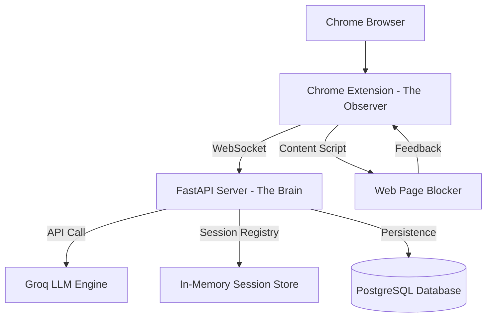

# Architecture Design - FocusFlow

## 1. System Overview
FocusFlow follows a client-server architecture where the Chrome Extension acts as the **Observer** and the FastAPI backend acts as the **Brain**.

## 2. Component Breakdown

### 2.1 The Observer (Frontend)
- **Background Script:** Uses `chrome.tabs.onUpdated` and `chrome.tabs.onActivated` to monitor user activity. It maintains the state of the "Focus Tab" and reports deviations.
- **WebSocket Client:** Manages a persistent connection to the Brain, identified by a unique `session_id`.
- **Content Scripts:** Injected into tabs to enforce "blocks." It uses a premium CSS overlay to obscure distracting content and collects user feedback.
- **Popup UI:** Built with Vanilla HTML/CSS/JS. Allows users to initialize sessions, set their focus goal, and pin a "Focus Tab."

### 2.2 The Brain (Backend)
- **FastAPI Core:** Provides the WebSocket server and REST endpoints for session initialization and history retrieval.
- **LLM Service (Groq):** A dedicated service that crafts prompts for the Groq API, incorporating the user's focus goal and recent tab history (context window).
- **Session Registry:** Replaces the global state to support multiple concurrent users, each with their own tracker and history.
- **Scoring Engine:** A logic layer that calculates distraction levels based on LLM feedback, focus tab proximity, and user history.
- **Database (PostgreSQL):** Persists session data, distraction logs, and user configurations for long-term analytics.

## 3. Technology Stack
- **Frontend:** HTML5, CSS3, ES6 JavaScript, Chrome Extensions API (Manifest V3).
- **Backend:** Python 3.10+, FastAPI, `websockets`, `uvicorn`.
- **AI:** Groq Cloud API (Llama-3-70b or similar).
- **Hosting:** Render (Free Tier).

## 4. Security & Privacy
- **Encryption:** WebSocket connections should use `wss://` in production.
- **Local-First:** While the brain runs on Render, the user's browsing history is ephemeral and cleared at the end of each session.
- **Minimal Extraction:** Only URL and Title are sent to the brain; no full DOM content is transmitted in the MVP.
