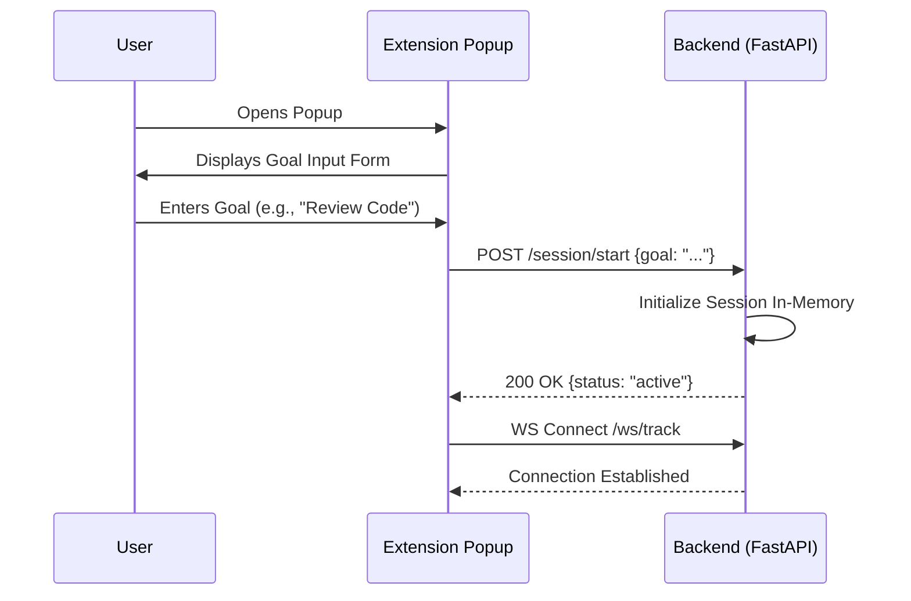
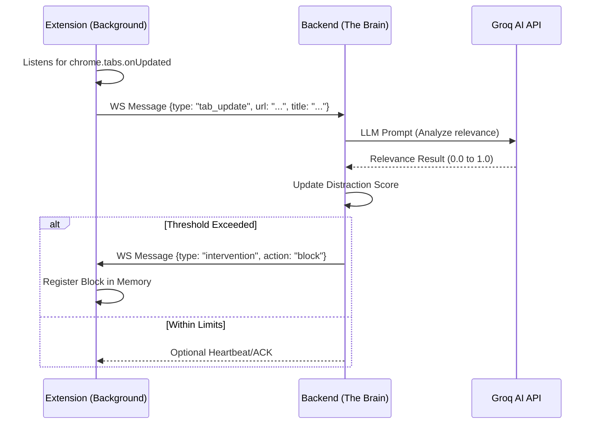
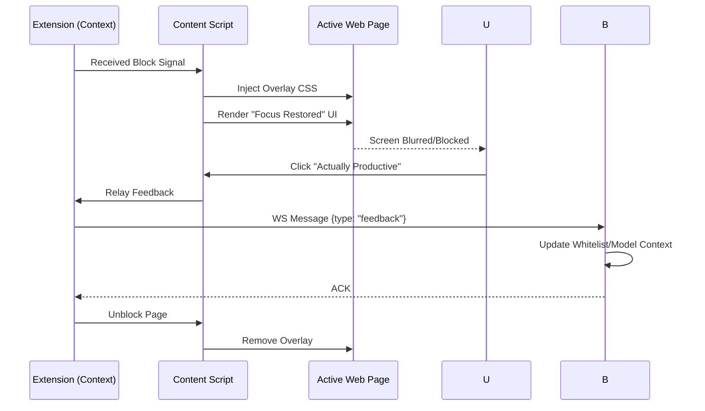

# System Flow - FocusFlow

## 1. Session Initialization

```mermaid
sequenceDiagram
    participant U as User
    participant E as Extension Popup
    participant B as Backend (FastAPI)
    
    U->>E: Opens Popup
    E->>U: Displays Goal Input Form
    U->>E: Enters Goal (e.g., "Review Code")
    E->>B: POST /session/start {goal: "..."}
    B->>B: Initialize Session In-Memory
    B-->>E: 200 OK {status: "active"}
    E->>B: WS Connect /ws/track
    B-->>E: Connection Established
```

## 2. Tab Change & Analysis

```mermaid
sequenceDiagram
    participant E as Extension (Background)
    participant B as Backend (The Brain)
    participant G as Groq AI API
    
    E->>E: Listens for chrome.tabs.onUpdated
    E->>B: WS Message {type: "tab_update", url: "...", title: "..."}
    B->>G: LLM Prompt (Analyze relevance)
    G-->>B: Relevance Result (0.0 to 1.0)
    B->>B: Update Distraction Score
    alt Threshold Exceeded
        B->>E: WS Message {type: "intervention", action: "block"}
        E->>E: Register Block in Memory
    else Within Limits
        B-->>E: Optional Heartbeat/ACK
    end
```

## 3. Intervention & Blocking

```mermaid
sequenceDiagram
    participant E as Extension (Context)
    participant CS as Content Script
    participant P as Active Web Page
    
    E->>CS: Received Block Signal
    CS->>P: Inject Overlay CSS
    CS->>P: Render "Focus Restored" UI
    P-->>U: Screen Blurred/Blocked
    U->>CS: Click "Actually Productive"
    CS->>E: Relay Feedback
    E->>B: WS Message {type: "feedback"}
    B->>B: Update Whitelist/Model Context
    B-->>E: ACK
    E->>CS: Unblock Page
    CS->>P: Remove Overlay
```
