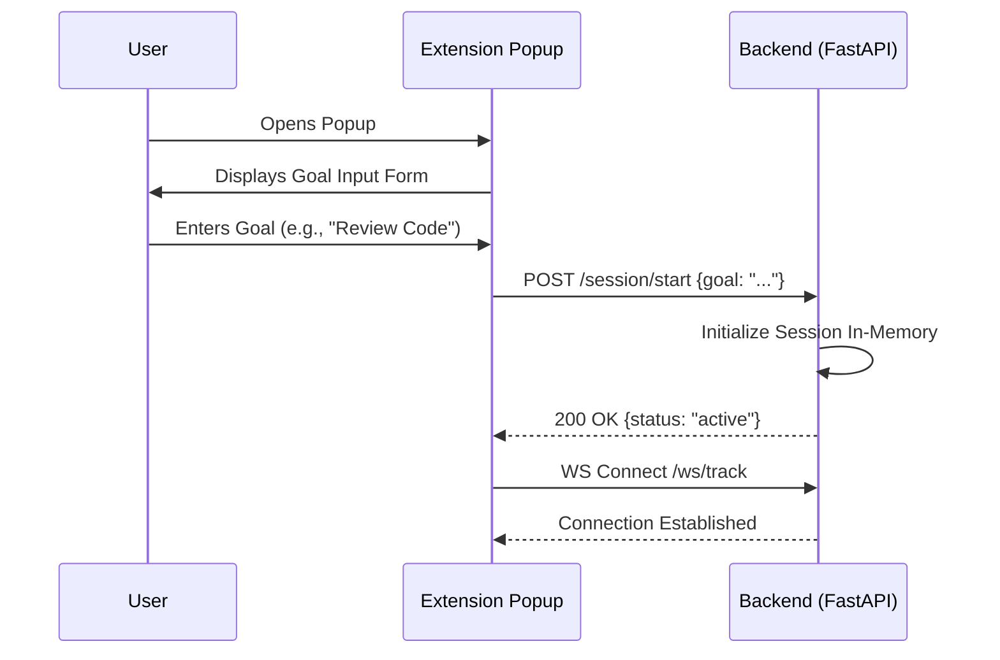
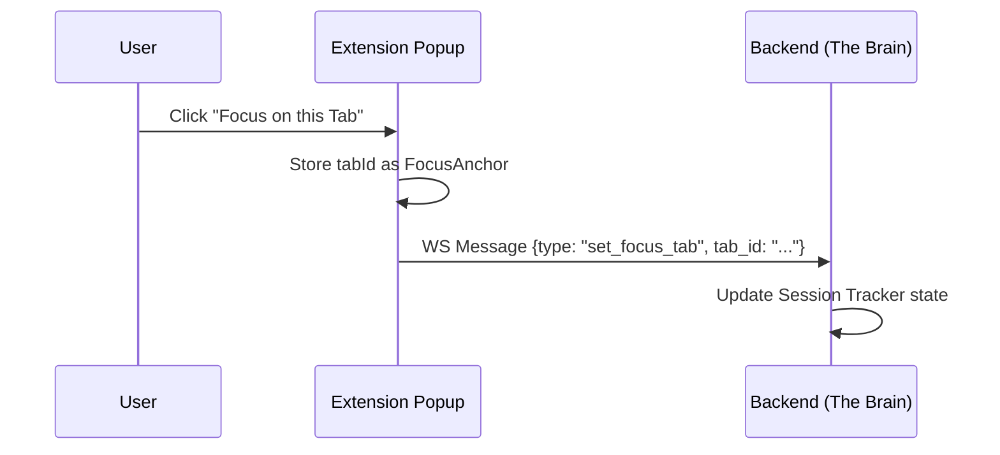
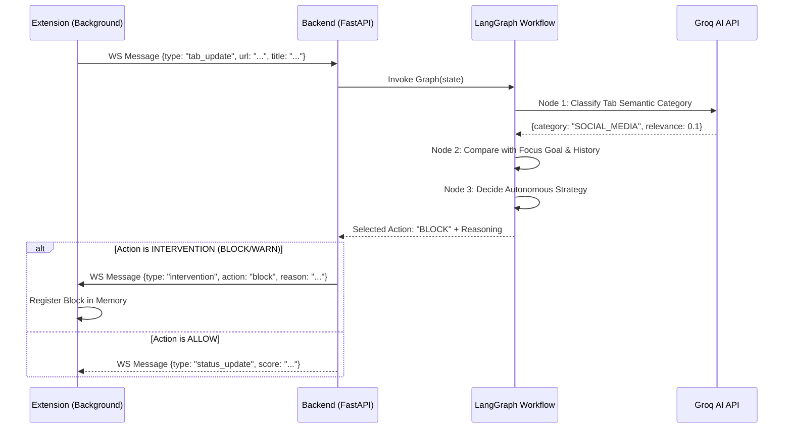
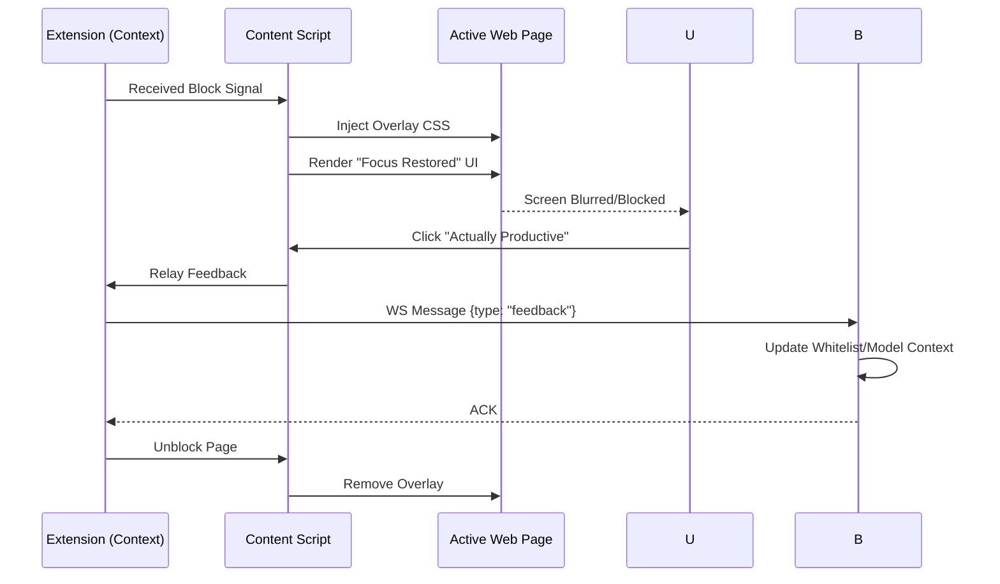

# System Flow - FocusFlow

## 1. Session Initialization

```mermaid
sequenceDiagram
    participant U as User
    participant E as Extension Popup
    participant B as Backend (FastAPI)
    
    U->>E: Opens Popup
    E->>U: Displays Goal Input Form
    U->>E: Enters Goal (e.g., "Review Code")
    E->>B: POST /session/start {goal: "..."}
    B->>B: Initialize Session In-Memory
    B-->>E: 200 OK {status: "active"}
    E->>B: WS Connect /ws/track
    B-->>E: Connection Established
```

## 2. Focus Tab Selection

```mermaid
sequenceDiagram
    participant U as User
    participant E as Extension Popup
    participant B as Backend (The Brain)
    
    U->>E: Click "Focus on this Tab"
    E->>E: Store tabId as FocusAnchor
    E->>B: WS Message {type: "set_focus_tab", tab_id: "..."}
    B->>B: Update Session Tracker state
```

## 3. Tab Change & Agentic Analysis (LangGraph)

```mermaid
sequenceDiagram
    participant E as Extension (Background)
    participant B as Backend (FastAPI)
    participant LG as LangGraph Workflow
    participant G as Groq AI API
    
    E->>B: WS Message {type: "tab_update", url: "...", title: "..."}
    B->>LG: Invoke Graph(state)
    LG->>G: Node 1: Classify Tab Semantic Category
    G-->>LG: {category: "SOCIAL_MEDIA", relevance: 0.1}
    LG->>LG: Node 2: Compare with Focus Goal & History
    LG->>LG: Node 3: Decide Autonomous Strategy
    LG-->>B: Selected Action: "BLOCK" + Reasoning
    alt Action is INTERVENTION (BLOCK/WARN)
        B->>E: WS Message {type: "intervention", action: "block", reason: "..."}
        E->>E: Register Block in Memory
    else Action is ALLOW
        B-->>E: WS Message {type: "status_update", score: "..."}
    end
```

## 3. Intervention & Blocking

```mermaid
sequenceDiagram
    participant E as Extension (Context)
    participant CS as Content Script
    participant P as Active Web Page
    
    E->>CS: Received Block Signal
    CS->>P: Inject Overlay CSS
    CS->>P: Render "Focus Restored" UI
    P-->>U: Screen Blurred/Blocked
    U->>CS: Click "Actually Productive"
    CS->>E: Relay Feedback
    E->>B: WS Message {type: "feedback"}
    B->>B: Update Whitelist/Model Context
    B-->>E: ACK
    E->>CS: Unblock Page
    CS->>P: Remove Overlay
```
